# μOS Architecture

*Visual documentation of the μOS system architecture using Mark Lombardi-inspired network diagrams*

---

## System Overview

The μOS ecosystem consists of four interconnected pillars, each building upon the cryptographic foundation.

```mermaid
flowchart TB
    subgraph FOUNDATION["🔐 CRYPTOGRAPHIC FOUNDATION"]
        MU["μ = e^(i·3π/4)"]
        ALPHA["α ≈ 1/137"]
        PHI["φ = Golden Ratio"]

        MU --> VZ["V_Z Quantization"]
        ALPHA --> VZ
        PHI --> GOLDEN["Golden Sequences"]
    end

    subgraph CRYPTO["📚 libmu-crypto"]
        direction TB
        CIPHER["μ-Spiral Cipher"]
        HASH["μ-Hash"]
        SIG["μ-Signatures"]
        KDF["μ-KDF"]
        RNG["μ-RNG"]

        VZ --> CIPHER
        VZ --> HASH
        VZ --> SIG
        GOLDEN --> KDF
        HASH --> RNG
    end

    subgraph CHAIN["⛓️ ChainMesh"]
        direction TB
        CONSENSUS["μ-PoS Consensus"]
        TYPES["Core Types"]
        CONTRACTS["Smart Contracts"]

        GOLDEN --> CONSENSUS
        SIG --> CONSENSUS
        HASH --> TYPES
    end

    subgraph NET["🌐 MuonNet"]
        direction TB
        ONION["Onion Routing"]
        HIDDEN["Hidden Services"]
        P2P["P2P Gossip"]
    end

    subgraph KERNEL["⚙️ μKernel"]
        direction TB
        CAPS["Capabilities"]
        IPC["Message IPC"]
        DRIVERS["Drivers"]
    end

    CRYPTO --> CHAIN
    CRYPTO --> NET
    CRYPTO --> KERNEL
    CHAIN --> NET
    NET --> KERNEL

    classDef foundation fill:#1a1a2e,stroke:#e94560,stroke-width:2px,color:#fff
    classDef crypto fill:#16213e,stroke:#0f3460,stroke-width:2px,color:#fff
    classDef chain fill:#0f3460,stroke:#e94560,stroke-width:2px,color:#fff
    classDef net fill:#533483,stroke:#e94560,stroke-width:2px,color:#fff
    classDef kernel fill:#2c061f,stroke:#e94560,stroke-width:2px,color:#fff

    class MU,ALPHA,PHI,VZ,GOLDEN foundation
    class CIPHER,HASH,SIG,KDF,RNG crypto
    class CONSENSUS,TYPES,CONTRACTS chain
    class ONION,HIDDEN,P2P net
    class CAPS,IPC,DRIVERS kernel
```

---

## μ-Cryptography Internals

The cryptographic primitives form an interconnected web where each component reinforces the others.

```mermaid
flowchart LR
    subgraph PRIMITIVES["Mathematical Primitives"]
        MU["μ = (-1+i)/√2"]
        MU8["μ^8 = 1<br/>Closure"]
        BALANCE["|Re| = |Im|<br/>Balance"]
        SPIRAL["135° Spiral<br/>Geometry"]

        MU --> MU8
        MU --> BALANCE
        MU --> SPIRAL
    end

    subgraph CIPHER_ENGINE["μ-Spiral Cipher Engine"]
        direction TB
        SBOX["S-Box<br/>V_Z Sampling"]
        PERM["Permutation<br/>μ-Rotation"]
        MIX["MixColumns<br/>Balance Diffusion"]
        ROUNDS["8 Rounds<br/>μ^8 Closure"]

        SBOX --> PERM
        PERM --> MIX
        MIX --> ROUNDS
        ROUNDS -.-> SBOX
    end

    subgraph HASH_ENGINE["μ-Hash Sponge"]
        direction TB
        ABSORB["Absorb Phase"]
        SQUEEZE["Squeeze Phase"]
        SPONGE["Sponge State<br/>1600 bits"]

        ABSORB --> SPONGE
        SPONGE --> SQUEEZE
    end

    subgraph SIGNATURE["μ-Signature Scheme"]
        direction TB
        KEYPAIR["Key Generation<br/>Seed → (sk, pk)"]
        COMMIT["Commitment<br/>R = k·G"]
        CHALLENGE["Challenge<br/>e = H(R,pk,m)"]
        RESPONSE["Response<br/>s = k + e·sk"]

        KEYPAIR --> COMMIT
        COMMIT --> CHALLENGE
        CHALLENGE --> RESPONSE
    end

    SPIRAL --> SBOX
    MU8 --> ROUNDS
    BALANCE --> MIX

    MIX --> ABSORB
    ROUNDS --> SPONGE

    SQUEEZE --> CHALLENGE
    SPONGE --> KEYPAIR

    classDef prim fill:#2d132c,stroke:#ee4540,stroke-width:2px,color:#fff
    classDef cipher fill:#801336,stroke:#ee4540,stroke-width:2px,color:#fff
    classDef hash fill:#c72c41,stroke:#fff,stroke-width:2px,color:#fff
    classDef sig fill:#ee4540,stroke:#2d132c,stroke-width:2px,color:#fff

    class MU,MU8,BALANCE,SPIRAL prim
    class SBOX,PERM,MIX,ROUNDS cipher
    class ABSORB,SQUEEZE,SPONGE hash
    class KEYPAIR,COMMIT,CHALLENGE,RESPONSE sig
```

---

## ChainMesh Blockchain Architecture

The blockchain layer weaves together consensus, state management, and smart contracts.

---

## Validator Selection Flow

The golden ratio-based validator selection creates a deterministic yet unpredictable sequence.

```mermaid
flowchart LR
    subgraph INPUT["Selection Inputs"]
        EPOCH_SEED["Epoch Seed<br/>H(prev_block)"]
        SLOT_NUM["Slot Number<br/>0-7"]
        VAL_SET["Active<br/>Validators"]
    end

    subgraph GOLDEN_ALGO["Golden Sequence Algorithm"]
        direction TB
        FRAC["Fractional Part<br/>{n · φ}"]
        SCALE["Scale to<br/>Validator Count"]
        INDEX["Validator<br/>Index"]

        FRAC --> SCALE
        SCALE --> INDEX
    end

    subgraph VZ_WEIGHT["V_Z Stake Weighting"]
        direction TB
        STAKE["Raw Stake"]
        QUANTIZE["Z = floor(stake/min)"]
        VZ_CALC["V_Z = Z · α · μ"]
        WEIGHT["|V_Z| Weight"]

        STAKE --> QUANTIZE
        QUANTIZE --> VZ_CALC
        VZ_CALC --> WEIGHT
    end

    subgraph OUTPUT["Block Production"]
        PROPOSER["Selected<br/>Proposer"]
        BACKUP["Backup<br/>Proposers"]
        ATTESTERS["Attester<br/>Committee"]
    end

    EPOCH_SEED --> FRAC
    SLOT_NUM --> FRAC
    VAL_SET --> VZ_WEIGHT

    INDEX --> PROPOSER
    WEIGHT --> INDEX

    PROPOSER --> BACKUP
    VAL_SET --> ATTESTERS

    classDef input fill:#003049,stroke:#fcbf49,stroke-width:2px,color:#fff
    classDef golden fill:#d62828,stroke:#fcbf49,stroke-width:2px,color:#fff
    classDef vz fill:#f77f00,stroke:#003049,stroke-width:2px,color:#000
    classDef output fill:#fcbf49,stroke:#003049,stroke-width:2px,color:#000

    class EPOCH_SEED,SLOT_NUM,VAL_SET input
    class FRAC,SCALE,INDEX golden
    class STAKE,QUANTIZE,VZ_CALC,WEIGHT vz
    class PROPOSER,BACKUP,ATTESTERS output
```

---

## NFT & Marketplace Ecosystem

A comprehensive digital ownership and trading network.

---

## Game Licensing System

Digital game ownership with activation tracking and license types.

---

## Token Economics Flow

The μCoin (MUC) economic model with staking, rewards, and fee distribution.

```mermaid
flowchart TB
    subgraph SUPPLY["Token Supply"]
        direction TB
        TOTAL["Total Supply<br/>137,036,000 MUC"]
        CIRCULATING["Circulating"]
        STAKED["Staked"]
        BURNED["Burned"]

        TOTAL --> CIRCULATING
        TOTAL --> STAKED
        TOTAL --> BURNED
    end

    subgraph UNITS["Unit System"]
        direction LR
        MUC["1 MUC"]
        MUON["1 muon = 10⁻⁸ MUC"]

        MUC --> |"100,000,000"| MUON
    end

    subgraph REWARDS["Block Rewards"]
        direction TB
        BASE["Base Reward<br/>1000 MUC"]
        HALVING["Halving<br/>Every 2.1M blocks"]
        PROPOSER_BONUS["Proposer<br/>10% Bonus"]
        ATTESTER_SHARE["Attester<br/>Share"]

        BASE --> HALVING
        HALVING --> PROPOSER_BONUS
        HALVING --> ATTESTER_SHARE
    end

    subgraph STAKING["Staking Mechanics"]
        direction TB
        MIN_STAKE["Min Stake<br/>10,000 MUC"]
        DELEGATE["Delegation"]
        COMMISSION["Validator<br/>Commission"]
        UNBOND["Unbonding<br/>21 Epochs"]

        MIN_STAKE --> DELEGATE
        DELEGATE --> COMMISSION
        COMMISSION --> UNBOND
    end

    subgraph SLASHING["Slashing Penalties"]
        direction TB
        DOUBLE_SIGN["Double Sign<br/>-5%"]
        DOWNTIME["Downtime<br/>-1%"]
        JAIL["Jail Period"]

        DOUBLE_SIGN --> BURNED
        DOWNTIME --> BURNED
        DOUBLE_SIGN --> JAIL
        DOWNTIME --> JAIL
    end

    subgraph FEES["Fee Distribution"]
        direction TB
        TX_FEE["Transaction<br/>Fees"]
        PLATFORM["Platform Fee<br/>2.5%"]
        ROYALTIES["Creator<br/>Royalties"]

        TX_FEE --> PROPOSER_BONUS
        PLATFORM --> CIRCULATING
        ROYALTIES --> CIRCULATING
    end

    REWARDS --> CIRCULATING
    STAKING --> STAKED

    classDef supply fill:#582f0e,stroke:#faedcd,stroke-width:2px,color:#fff
    classDef units fill:#7f4f24,stroke:#faedcd,stroke-width:2px,color:#fff
    classDef rewards fill:#936639,stroke:#faedcd,stroke-width:2px,color:#fff
    classDef staking fill:#a68a64,stroke:#582f0e,stroke-width:2px,color:#000
    classDef slash fill:#b6ad90,stroke:#582f0e,stroke-width:2px,color:#000
    classDef fees fill:#faedcd,stroke:#582f0e,stroke-width:2px,color:#000

    class TOTAL,CIRCULATING,STAKED,BURNED supply
    class MUC,MUON units
    class BASE,HALVING,PROPOSER_BONUS,ATTESTER_SHARE rewards
    class MIN_STAKE,DELEGATE,COMMISSION,UNBOND staking
    class DOUBLE_SIGN,DOWNTIME,JAIL slash
    class TX_FEE,PLATFORM,ROYALTIES fees
```

---

## Epoch & Finality Timeline

The 8-block epoch structure with checkpoint finality.

---

## Complete Data Flow

How data flows through the entire system from user action to finalized state.

---

## Module Dependency Graph

The interconnections between all μOS modules.

---

*"In the spiral of μ, balance emerges from chaos."*

